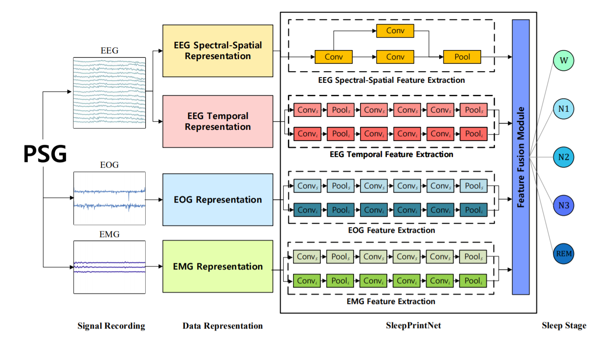

# SleepPrintNet

SleepPrintNet: A Multivariate Multimodal Neural Network based on Physiological Time-series for Automatic Sleep Staging



The SleepPrintNet is made up of four independent modules: EEG temporal feature extraction module, EEG spectral-spatial feature extraction module, EOG feature extraction module, and EMG feature extraction module. After extracting the corresponding features from each module, we use a feature fusion layer to fuse all the features, and finally obtain the classification results through a classification layer. 

These are the source code of SleepPrintNet.

# Dataset

 We evaluate our model on the [Montreal Archive of Sleep Studies (MASS) ](http://massdb.herokuapp.com/en/)dataset Subset-3. The MASS is an open-access and collaborative database of laboratory-based polysomnography (PSG) recordings. 

# Requirements

- Python 3.6.5
- CUDA 9.0
- CuDNN 7.5.1
- numpy==1.15.0
- sklearn==0.19.1
- tensorflow_gpu==1.8.0
- Keras==2.2.0
- matplotlib==3.0.3

# Usage

- Preprocess

  - Prepare data (raw signals) in `data_dir`
    - Files name: 01-03-00**XX**-Data.npy, where **XX** denotes subject ID.
    - Tensor shape: **[sample, channel=26, length]**, where channel 0 is ECG channel, 1-20 are EEG channels, 21-23 are EMG channels, 24-25 are EOG channels.
  - Modify directory
    - Modify `data_dir` and `label_dir`  in `run_preprocess.py` accordingly.
    - (Optional) Modify `output_dir` in  `run_preprocess.py`.
  - Run preprocess program
    - `cd preprocess`
    - `python run_preprocess.py`

- Command Line Parameters

  - Training
    - `--batch_size`: Training batch size.
    - `--epoch`: Number of training epochs.
    - `--num_fold`: Number of folds.
    - `--save_model`: Save the best model or not.
  - Directory 
    - `--model_dir`: The directory for saving best models of each fold.
    - `--data_dir1`: The directory of the EEG, EOG signals.
    - `--data_dir2`: The directory of the EMG signals.
    - `--data_dir3`: The directory of the spectral-spatial representation of EEG signals.
    - `--result_dir`:  The directory for saving results.

- Input Data Shape

  - EEG_EOG
    - Data**SubID**.npy : (numOfSamples, numOfChannels, timeLength) -> (numOfSamples, 6 + 2, 30 * 128 * 3)
      - numOFChannels: 6 channels EEG signals and 2 channels EOG signals.
      - timeLength: 30 (s) * 128 (Hz) * 3 (epochs) = 11520
    - Label**SubID**.npy: (numOfSamples, ) 
  - EMG
    - Data**SubID**.npy : (numOfSamples, numOfChannels, timeLength) -> (numOfSamples, 3, 11520)
      - numOFChannels: 3 channels EMG signals.
      - timeLength: 30 (s) * 128 (Hz) * 3 (epochs) = 11520
    - Label**SubID**.npy: (numOfSamples, ) 
  - fre_spa
    - Data**SubID**.npy : (numOfSamples, numOfFreqBands, height, width, 1) -> (numOfSamples, 5, 16, 16, 1)
      - numOfFreqBands: 5 frequency bands ($\delta, \theta, \alpha, \beta, \gamma$)
      - height, width: 16 px $\times$ 16 px
    - Label**SubID**.npy: (numOfSamples, ) 
  
- Training

  Run `run.py` with the command line parameters. By default, the model can be run with the following command:

  ```
  CUDA_VISIBLE_DEVICES=0 python run.py
  ```
